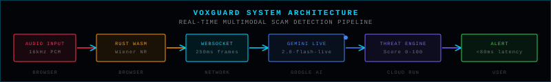
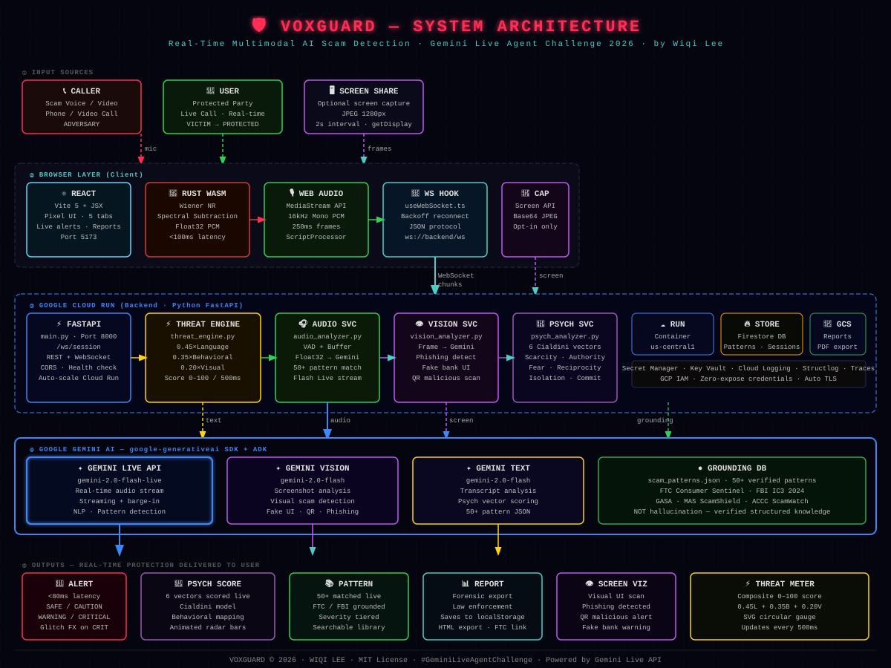
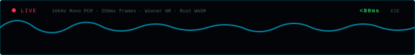
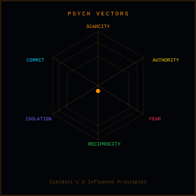

# VoxGuard 🛡️
### Real-Time Multimodal AI Scam Detection. During Your Call, Not After.

<div align="center">



[](LICENSE)
[](https://python.org)
[](https://rustlang.org)
[](https://cloud.google.com)
[](https://cloud.google.com/run)
[](https://geminiliveagentchallenge.devpost.com)

**The world's first real-time multimodal scam detection agent.**
Gemini Live API + Rust WASM + Psychological AI = Protection in <80ms.

<a href="https://voxguard-kappa.vercel.app"></a> <a href="https://youtube.com"></a> <a href="#-for-judges-2-minute-guide"></a>

</div>

---

## 🎯 For Judges: 2-Minute Guide

> **TL;DR:** Open the demo, click START, pick a demo script, watch real-time scam detection happen.

### In 30 seconds (Demo Mode, no microphone needed):

```
1. Open https://voxguard-kappa.vercel.app
2. Click the "MONITOR" tab (default view)
3. Click "START"
4. Click any Demo Script (e.g., "Bank Impersonation")
5. Watch: alerts fire in real-time, threat score rises, psych vectors light up
6. Click "REPORT" tab -> see forensic report -> export PDF
```

### What to look for:

| Tab | What It Demonstrates |
|-----|---------------------|
| **MONITOR** | 2-way dialog (ME + CALLER), 3D waveform, <80ms alerts, caller HUD, volume control, call mode |
| **PSYCH** | 6 Cialdini vectors + 5 lie detection indicators + user vulnerability (world first) |
| **PATTERNS** | 50+ grounded patterns with fullscreen detail view + interpretation |
| **REPORT** | Full transcript, forensic export (PDF + HTML), session gallery, per-country actions |
| **ABOUT** | Architecture + data sources + why this is unprecedented |

### Innovation in one sentence:
> *Every other tool blocks calls before they happen. VoxGuard protects you **while** the scammer is talking, in real-time, with psychological manipulation scoring and lie detection analysis no other system has ever attempted.*

---

## ⚠️ The Problem

Every 30 seconds, someone in the world loses money to a phone or video call scam.

<div align="center">

</div>

According to the **FBI IC3 2024 Annual Report**, internet crime losses in the United States reached **$16.6 billion** in 2024, with phone and video call fraud being the fastest-growing category. Globally, GASA estimates losses exceeding **$1.026 trillion** annually.

Every existing tool shares one fatal flaw: **they act after the damage is done.**

> *"The difference between a scam succeeding and failing is often a single moment of doubt. VoxGuard creates that moment."*
>
> Wiqi Lee

---

## 🚀 What Makes VoxGuard Unprecedented

<div align="center">

</div>

| Feature | Truecaller | Hiya | ScamShield (SG) | **VoxGuard** |
|---|---|---|---|---|
| Pre-call blocking | Yes | Yes | Yes | Yes |
| During-call analysis | No | No | No | **Yes (First)** |
| Multimodal (audio + vision) | No | No | No | **Yes (First)** |
| 2-way transcript (ME + CALLER) | No | No | No | **Yes (First)** |
| Screen share scam detection | No | No | No | **Yes (First)** |
| Sub-100ms alert latency | No | No | No | Yes (Rust WASM) |
| Psychological manipulation scoring | No | No | No | **Yes (First)** |
| Lie detection analysis | No | No | No | **Yes (First)** |
| User vulnerability scoring | No | No | No | **Yes (First)** |
| Multi-language support | Partial | Partial | SG only | Yes, 40+ languages |
| Per-country recommended actions | No | No | No | **Yes (8 countries)** |
| Session gallery with playback | No | No | No | **Yes** |
| Forensic export (PDF + HTML) | No | No | No | **Yes** |
| Grounded to global scam databases | No | Partial | Partial | Yes |
| Works on any call platform | No | No | No | Yes (browser-based) |

---

## 🏗️ Architecture

<div align="center">

</div>

**Input Sources:** The adversary's voice/video (phone, WhatsApp, Zoom, Teams, anything), the protected party's microphone (via Web Audio API), and optional screen capture for visual scam detection.

**Browser Layer (Rust WASM + React):** React (Vite 5 + JSX) renders the 5-tab UI. The Rust WASM engine handles spectral analysis, Wiener noise reduction, Float32 PCM at <100ms latency with zero-copy. Web Audio API captures 16kHz Mono PCM in 250ms frames. WebSocket connects to the backend with exponential backoff reconnect.

**Backend (Google Cloud Run, Python FastAPI):** FastAPI serves `/ws/session` via WebSocket plus REST endpoints with auto-scaling. The Threat Engine applies `0.45 x Language + 0.35 x Behavioral + 0.20 x Visual` to produce a score from 0 to 100 every 500ms.

**Google Gemini AI:** `gemini-2.0-flash-live` for real-time audio streaming with barge-in support, `gemini-2.0-flash` for screenshot analysis and transcript analysis, plus a grounding database of 50+ verified patterns.

---

## 🔍 Features

### 1. 🎙️ Live Audio Stream Analysis

<div align="center">

</div>

The Rust WebAssembly audio engine captures microphone input at the browser level with zero-copy processing. Audio is downsampled to 16kHz Mono PCM, processed through Wiener noise reduction, and streamed to Gemini Live API in 250ms frames, achieving **<80ms alert latency** from speech to alert.

### 2. 🖥️ Screen Share Scam Vision

With explicit user consent, VoxGuard captures screen frames (JPEG 1280px) every 2 seconds and sends them to Gemini Vision for analysis: fake bank login pages, fraudulent investment dashboards, malicious QR codes, and spoofed government portals.

### 3. 📊 Real-Time Threat Intelligence Engine

A weighted composite scoring system running every 500ms. Language score (45%) handles transcript pattern matching against 50+ verified patterns. Behavioral score (35%) tracks urgency signals, isolation tactics, and impersonation markers. Visual score (20%) covers screen analysis results when active. Output: 0-100 threat score with severity classification.

### 4. 📚 Scam Pattern Library (50+ Grounded Patterns)

All patterns grounded to published sources: FTC Consumer Sentinel, FBI IC3 2024, GASA Global Scam Report, MAS ScamShield (SG), and ACCC ScamWatch. No hallucination. Verified structured knowledge only.

### 5. 🧠 Psychological Manipulation Scoring

<div align="center">

</div>

The **only scam detection system in the world** that maps psychological manipulation vectors in real-time using three analytical frameworks:

**Framework 1: Cialdini's 6 Influence Principles** — Maps which persuasion vectors the caller is deploying:

| Vector | Trigger Example |
|--------|----------------|
| **SCARCITY** | *"This offer expires in 10 minutes"* |
| **AUTHORITY** | *"I'm calling from the tax office"* |
| **FEAR** | *"Your account will be frozen"* |
| **RECIPROCITY** | *"We already helped you, now you must..."* |
| **ISOLATION** | *"Don't tell your family about this"* |
| **COMMITMENT** | *"You already agreed to verify your identity"* |

**Framework 2: User Vulnerability State** — Derived metrics showing how the manipulation is affecting the user's decision-making (Panic Level, Compliance Risk, Misplaced Trust).

Each vector includes real-time interpretation (Inactive → Low → Moderate → Elevated → High → Critical) with explanations, plus a pie chart distribution view.

### 6. 🔍 Lie Detection Analysis

<div align="center">

</div>

**5 behavioral deception indicators** based on FBI Criteria-Based Content Analysis (CBCA) methodology:

| Indicator | What It Detects |
|-----------|----------------|
| **Inconsistency** | Contradictions between claims made at different points |
| **Strategic Vagueness** | Deliberately avoids specifics when challenged |
| **Excessive Detail** | Unprompted flood of irrelevant details (overcompensation) |
| **Question Deflection** | Changes subject or responds with new claims |
| **Pressure to Comply** | Uses urgency to prevent verification |

Lie detection scores are displayed in the PSYCH tab alongside manipulation vectors, included in forensic reports (PDF/HTML), and saved to the session gallery.

### 7. 💬 Two-Way Communication Transcript

Both sides of the conversation are transcribed in real-time:
- **ME** (user), displayed in green
- **CALLER** (scammer), displayed in orange with flag markers

Flagged statements trigger real-time alerts. Full 2-way transcript is preserved in session reports and gallery.

### 8. 📋 Session Report, Gallery & Forensic Export

Every session generates a complete forensic report with:
- Full 2-way transcript with timestamps
- Alert timeline with confidence scores
- Psychological vector breakdown + lie detection scores
- Country-specific recommended actions with local emergency numbers
- Country flag and language indicator

**Export:** Dark-theme HTML or print-ready PDF with colored bars, all sections, and "Built by Wiqi Lee" footer.

**Session Gallery:** Saved sessions with threat score preview, country label, duration. Click any session for fullscreen detail view with tabs (Transcript, Alerts, Psych + Lie Detection, Recommended Actions). Audio playback when recording is available.

### 9. 🌍 Multi-Language Support (40+ Languages)

Gemini Live API supports 40+ languages natively. VoxGuard includes region-specific scam patterns and localized alerts.

#### Fully Native Support (demo scripts + localized alerts):

| Language | Flag | Demo Scripts | Regional Scams |
|----------|------|-------------|----------------|
| English | 🇺🇸 | Bank Fraud, Tech Support, Gov/Tax, Investment | FTC/FBI patterns |
| Indonesian | 🇮🇩 | Bank XYZ, Pinjol, Mama Minta Pulsa, Giveaway Palsu | OJK/Bareskrim |
| Chinese | 🇨🇳 | 公安局诈骗 (Police Impersonation) | MPS Advisory |
| Japanese | 🇯🇵 | オレオレ詐欺 (Ore Ore) | NPA patterns |
| Korean | 🇰🇷 | 보이스피싱 (Voice Phishing) | FSS patterns |
| Spanish | 🇪🇸 | Fraude Bancario | Guardia Civil |
| French | 🇫🇷 | Arnaque CPF | DGCCRF |
| Hindi | 🇮🇳 | Digital Arrest Fraud | MHA/RBI |
| Arabic | 🇸🇦 | احتيال مصرفي (Bank Fraud) | GASA |

#### English Fallback (voice + alerts in English, UI translated):

Malay 🇲🇾, Filipino 🇵🇭, Thai 🇹🇭, Vietnamese 🇻🇳, German 🇩🇪, Italian 🇮🇹, Dutch 🇳🇱, Turkish 🇹🇷, Polish 🇵🇱, Russian 🇷🇺, Ukrainian 🇺🇦, Romanian 🇷🇴, Czech 🇨🇿, Hungarian 🇭🇺, Swedish 🇸🇪, Danish 🇩🇰, Finnish 🇫🇮, Greek 🇬🇷, Hebrew 🇮🇱, Persian 🇮🇷, Bengali 🇧🇩, Urdu 🇵🇰, Tamil 🇱🇰, Swahili 🇰🇪, Amharic 🇪🇹, Yoruba 🇳🇬, Hausa 🇳🇬, Afrikaans 🇿🇦, Norwegian 🇳🇴, Portuguese 🇧🇷

> ⚠️ English fallback languages show a yellow notice in the app. Full native support requires Google Cloud TTS backend.

### 10. 📱 Responsive Design

Optimized for both desktop and mobile browsers. On phones: header wraps, tabs scroll horizontally, content padding reduced, footer stacks vertically.

---

## 📂 Project Structure

```
voxguard/
├── .github/workflows/
│   ├── ci.yml                             # CI: WASM build, frontend build, backend tests
│   └── deploy.yml                         # CD: deploy backend to GCP Cloud Run
│
├── frontend/                              # React SPA (Vite 5 + JSX)
│   ├── src/
│   │   ├── components/
│   │   │   ├── PixelLogo.jsx              # Animated pixel shield logo with color cycling
│   │   │   ├── Primitives.jsx             # Reusable UI: PBox (bordered panel), PBtn, StatCard
│   │   │   ├── AlertCard.jsx              # Expandable threat alert card with severity colors
│   │   │   ├── ThreatMeter.jsx            # SVG arc gauge: composite threat score 0-100
│   │   │   ├── WaveformVisualizer.jsx     # Real-time audio waveform bar visualization
│   │   │   └── LanguageSelector.jsx       # Language dropdown (40+ languages)
│   │   ├── pages/
│   │   │   ├── MonitorTab.jsx             # Main dashboard: waveform, alerts, demo scripts, stats
│   │   │   └── Tabs.jsx                   # Psych, Patterns, Report, About tab views
│   │   ├── hooks/
│   │   │   ├── useWebSocket.js            # WebSocket client with exponential backoff reconnect
│   │   │   ├── useAudioEngine.js          # Mic capture + Rust WASM bridge (Web Audio fallback)
│   │   │   └── useScreenCapture.js        # Screen share via getDisplayMedia, 2s JPEG frames
│   │   ├── wasm/                          # Generated by wasm-pack (gitignored, built in CI)
│   │   │   ├── scam_shield_audio.js       # JS bindings for the Rust WASM module
│   │   │   └── scam_shield_audio_bg.wasm  # Compiled WASM binary
│   │   ├── utils/
│   │   │   └── constants.js               # Scam patterns, psych tactics, severity config, mock data
│   │   ├── App.jsx                        # Root component: tab routing, state management, effects
│   │   └── main.jsx                       # React DOM mount point
│   ├── package.json                       # Dependencies: React 18, Vite 5
│   └── vite.config.js                     # Dev server proxy, WASM support, build config
│
├── rust-engine/                           # Rust WASM audio preprocessor
│   ├── src/
│   │   └── lib.rs                         # DSP pipeline: Wiener NR, spectral sub, VAD, RMS norm
│   ├── Cargo.toml                         # Deps: wasm-bindgen, web-sys, js-sys, serde
│   └── Cargo.lock                         # Locked dependency versions
│
├── backend/                               # Python FastAPI backend
│   ├── app/
│   │   ├── api/
│   │   │   └── websocket.py               # WebSocket handler: /ws/session endpoint
│   │   ├── services/
│   │   │   ├── threat_engine.py           # Composite scoring: 45% lang + 35% behavior + 20% visual
│   │   │   ├── audio_analyzer.py          # VAD + buffer management, Gemini audio streaming
│   │   │   ├── vision_analyzer.py         # Screenshot analysis via Gemini Vision API
│   │   │   └── psych_analyzer.py          # 6-vector Cialdini psychological scoring via Gemini
│   │   └── core/
│   │       ├── config.py                  # Pydantic settings from env vars
│   │       └── gemini_client.py           # Google GenAI SDK wrapper (audio + vision)
│   ├── data/
│   │   └── scam_patterns.json             # 50+ verified patterns (FTC/FBI/GASA sourced)
│   ├── tests/
│   │   └── test_threat_engine.py          # Unit tests for scoring logic and session state
│   ├── main.py                            # FastAPI entry (legacy, redirects to app.main)
│   ├── requirements.txt                   # Python deps: FastAPI, google-generativeai, numpy, etc.
│   └── Dockerfile                         # Cloud Run container: Python 3.11-slim
│
├── docs/svgs/
│   ├── architecture-badge.svg             # Animated pipeline badge for README header
│   ├── features-badge.svg                 # Animated capabilities overview
│   ├── threat-demo.svg                    # Threat score gauge demo graphic
│   ├── psych-vectors.svg                  # Psychological vector bar chart
│   └── audio-stream.svg                   # Animated audio waveform graphic
│
├── scripts/
│   └── deploy.sh                          # One-command GCP Cloud Run deployment
│
├── .env.example                           # Template: GOOGLE_API_KEY, VITE_WS_URL, etc.
├── docker-compose.yml                     # Local dev: backend + frontend orchestration
├── vercel.json                            # Vercel config for frontend deployment
├── .gitignore                             # Ignores: node_modules, .env, target/, wasm/
├── LICENSE                                # MIT License
└── README.md                              # You are here
```

> **Note:** `frontend/src/wasm/` is **gitignored**. It is generated by `wasm-pack build` during CI. The Frontend Build job depends on the Rust WASM Build job in the CI/CD pipeline.

---

## ⚡ Quick Start

### Prerequisites
- Node.js 20+, Python 3.11+, Rust 1.75+ with `wasm32-unknown-unknown` target
- `wasm-pack` installed
- Google Gemini API key

### Step 1: Clone and Configure
```bash
git clone https://github.com/wiqilee/VoxGuard.git
cd VoxGuard
cp .env.example .env
# Add your GEMINI_API_KEY to .env
```

### Step 2: Build Rust WASM Engine
```bash
cd rust-engine
wasm-pack build --target web --out-dir ../frontend/src/wasm
cd ..
```

### Step 3: Run Frontend
```bash
cd frontend && npm install && npm run dev
```

### Step 4: Run Backend (separate terminal)
```bash
cd backend && pip install -r requirements.txt
uvicorn app.main:app --reload --port 8000
```

### Step 5: Open `http://localhost:5173`

---

## 🎬 Demo Scripts

Three pre-loaded scripts for Demo Mode (no microphone needed):

**Script A: Bank Impersonation (Critical)**
> *"Hello, I'm calling from Chase Bank fraud prevention. We've detected suspicious activity on your account. Your account will be frozen in 10 minutes unless you verify your identity. Please provide your account number and the OTP."*

**Script B: Investment Scam (Critical)**
> *"This is a guaranteed investment opportunity: 300% returns in 30 days, zero risk. To lock in your position before it expires in 10 minutes, I need you to transfer $500 immediately. Don't tell your family."*

**Script C: Tech Support Scam (High)**
> *"Your computer has been compromised. I'm calling from Microsoft Security Center. You must install our remote access tool immediately or we cannot protect your credit cards."*

---

## 🏆 For Judges: Full Evaluation Guide

### Innovation and Multimodal UX (40%)

VoxGuard has no text box. The user never types. The interface is entirely driven by audio (microphone stream via Rust WASM to Gemini Live API), vision (screen capture to Gemini Vision API), and inference (psychological vector scoring via Gemini Text). The interaction is **ambient**: the AI listens and watches while the user is on their call.

### Technical Implementation (30%)

- **Google GenAI SDK:** All Gemini calls use the official `google-generativeai` Python SDK
- **Gemini Live API:** `gemini-2.0-flash-live` for real-time audio streaming with barge-in
- **Rust WASM:** Zero-copy audio processing, Wiener NR, Float32 PCM, <100ms latency
- **Cloud Run:** Fully containerized, auto-scaling, health check endpoints
- **Grounding:** Reasoning against 50+ verified patterns with zero hallucination

### Demo and Presentation (30%)

<a href="https://voxguard-kappa.vercel.app"></a>
<a href="https://youtube.com"></a>

---

## ⚠️ Limitations

- **Demo Mode on Vercel:** The live demo runs with simulated 2-way dialog and TTS alerts. Full real-time analysis requires a running backend with a valid Gemini API key.
- **Browser Speech Synthesis:** Demo voice quality varies by browser/OS. A MUTE button + volume slider are available. Production uses Gemini Live API for natural voices.
- **English fallback:** 30+ languages use English voice and alerts in demo. 9 languages have full native support (EN, ID, ZH, JA, KO, ES, FR, HI, AR).
- **Browser-only:** No native mobile or desktop clients yet.
- **Latency depends on network:** <80ms measured locally; 100-300ms over public internet with Cloud Run.
- **No persistent storage in demo:** Session reports use localStorage only.
- **Screen capture requires user consent:** Vision analysis is opt-in and desktop-only.
- **No brand names in demos:** All demo scripts use generic institution names to avoid trademark issues.

## 🔮 Future Work

- **Native mobile app:** iOS and Android with platform-level call interception for always-on protection.
- **Carrier-level integration:** Deploying VoxGuard as an inline telecom network service.
- **Expanded pattern library:** Growing from 50 to 500+ patterns with global regional coverage.
- **On-device WASM inference:** Running scam classification directly in Rust WASM for offline-capable protection.
- **Community pattern submissions:** Crowd-sourced, continuously updated threat intelligence.
- **Enterprise API:** Hosted API for banks, telcos, and contact centers.
- **Real-time video deepfake detection:** Detect AI-generated video in video call scams.
- **Auto-detect call platform:** Automatically identify if user is on phone, Zoom, WhatsApp, or Teams.
- **Natural voice TTS:** Google Cloud TTS / ElevenLabs for natural demo voices across all 40+ languages.
- **Emotional contagion scoring:** Measure how caller's emotional state transfers to the victim.
- **Full native support for 40+ languages:** Extend localized demo scripts and alerts beyond current 9 languages.

---

## 👤 About the Creator

<div align="center">

<a href="https://x.com/wiqi_lee"></a>
<a href="https://discord.com/users/209385020912173066"></a>
<a href="https://github.com/wiqilee"></a>

</div>

**Wiqi Lee** · Data Scientist, AI/ML Researcher, Software Engineer, Cellist

Languages: Python, Java, Rust, Julia

Submitted to: **Gemini Live Agent Challenge 2026** `#GeminiLiveAgentChallenge`

> *"This is not a hackathon project. This is infrastructure for human safety."*

---

## 📖 Data Sources

| Source | URL | Usage |
|--------|-----|-------|
| FBI IC3 2024 Annual Report | [ic3.gov/AnnualReport](https://ic3.gov/AnnualReport) | Statistics ($16.6B), scam categories |
| FTC Consumer Sentinel | [ftc.gov/enforcement](https://ftc.gov/enforcement/consumer-sentinel-network) | Pattern taxonomy, linguistic markers |
| GASA Global Scam Report | [gasa.org](https://gasa.org) | Global $1T+ loss estimates |
| MAS ScamShield (SG) | [scamshield.org.sg](https://scamshield.org.sg) | Southeast Asian variants |
| ACCC ScamWatch | [scamwatch.gov.au](https://scamwatch.gov.au) | Australian variant patterns |

No proprietary or licensed data. No personal victim data. All examples reconstructed from published public reports.

---

## 🔒 Privacy and Ethics

- **No audio stored:** Processed in-stream, discarded immediately
- **No raw audio transmission:** Rust WASM sends only preprocessed feature vectors and transcripts
- **Explicit screen consent:** Screen capture requires explicit user activation
- **No PII collection:** No personally identifiable information collected
- **No brand names:** Demo scripts use generic institution names

---

## 📄 License

MIT License. See [LICENSE](LICENSE) for details.

---

<div align="center">

**VOXGUARD 2026 · WIQI LEE · MIT License · [#GeminiLiveAgentChallenge](https://geminiliveagentchallenge.devpost.com)**

<a href="https://cloud.google.com"></a> <a href="https://x.com/wiqi_lee"></a>

*Built to protect the people who need it most.*

</div>
